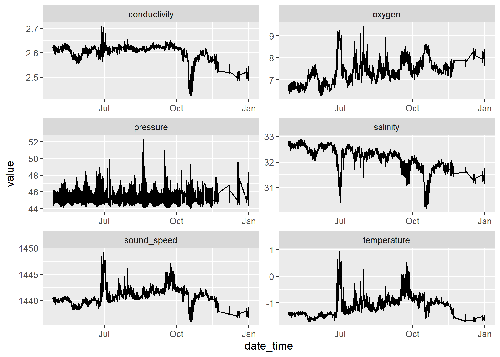

<!-- README.md is generated from README.Rmd. Please edit that file -->

# bsrto

<!-- badges: start -->

[](https://github.com/paleolimbot/bsrto/actions)
<!-- badges: end -->

The goal of bsrto is to provide a well-tested basis for generating data
products for the [Barrow Strait Real Time
Observatory](https://noise.phys.ocean.dal.ca/barrow/).

## Installation

You can install the development version from
[GitHub](https://github.com/) with:

``` r
# install.packages("remotes")
remotes::install_github("paleolimbot/bsrto")
```

``` r
library(bsrto)
```

The main event of the bsrto package are the `bs_build_()` functions,
which generate data products from data available on the ftp server. A
number of helper functions support them which can be useful when
debugging problems with the intermediary outputs. You will probably want
to set a persistent cache directory in your .Rprofile:

``` r
# local path to copy of the ftp server
options(bsrto.cache = "...")

# local build cache (will need invalidating if the
# read functions are updated)
options(bsrto.build_cache = "...")
```

Then you can build the real-time data\! It will take \~60 minutes the
first time (because it needs to download a few thousand files) and \~30
seconds each time thereafter.

``` r
bs_build_realtime()
```

## List files from the BSRTO server

…and plot them.

``` r
library(tidyverse)

latest <- bs_ftp_list("BSRTO/2019-2020/mcI") %>% 
  filter(size > 0) %>% 
  arrange(desc(file)) %>% 
  head(200) %>% 
  bs_cached(async = TRUE)
#> Listing directory 'ftp://dfoftp.ocean.dal.ca/pub/dfo/BSRTO/2019-2020/mcI/'

read_mc_vector(latest) %>% 
  pivot_longer(-c(file, date_time)) %>% 
  ggplot(aes(date_time, value)) +
  geom_line() +
  facet_wrap(vars(name), scales = "free", ncol = 2)
```



## Read functions for BSRTO files

``` r
read_hpb_vector(list.files(bs_example("hpb"), "\\.hpb$", full.names = TRUE))
#> # A tibble: 1 x 4
#>   file                                  date_time           atm_pres_mbar temp_c
#>   <chr>                                 <dttm>                      <dbl>  <dbl>
#> 1 C:/Users/dunningtond/Documents/R/win~ 2019-08-28 20:30:37          1004     17
read_icl(bs_example("icl/SAF2564_20191010_19.txt"))
#> # A tibble: 62 x 416
#>    Time                Comment `Temperature [C~ `Humidity [%]` `Sequence #`
#>    <dttm>              <chr>              <dbl>          <dbl>        <dbl>
#>  1 2019-10-10 19:04:39 "Time ~             -1.6           34.3           15
#>  2 2019-10-10 19:04:40 ""                  -1.6           34.3           16
#>  3 2019-10-10 19:04:41 ""                  -1.6           34.3           17
#>  4 2019-10-10 19:04:42 ""                  -1.7           34.1           18
#>  5 2019-10-10 19:04:43 ""                  -1.6           34.1           19
#>  6 2019-10-10 19:04:44 ""                  -1.6           34.1           20
#>  7 2019-10-10 19:04:45 ""                  -1.6           34.1           21
#>  8 2019-10-10 19:04:46 ""                  -1.6           34.1           22
#>  9 2019-10-10 19:04:47 ""                  -1.6           34.1           23
#> 10 2019-10-10 19:04:48 ""                  -1.6           34.1           24
#> # ... with 52 more rows, and 411 more variables: `Data Points` <dbl>,
#> #   `0` <dbl>, `15.63` <dbl>, `31.25` <dbl>, `46.88` <dbl>, `62.5` <dbl>,
#> #   `78.13` <dbl>, `93.75` <dbl>, `109.38` <dbl>, `125` <dbl>, `140.63` <dbl>,
#> #   `156.25` <dbl>, `171.88` <dbl>, `187.5` <dbl>, `203.13` <dbl>,
#> #   `218.75` <dbl>, `234.38` <dbl>, `250` <dbl>, `265.63` <dbl>,
#> #   `281.25` <dbl>, `296.88` <dbl>, `312.5` <dbl>, `328.13` <dbl>,
#> #   `343.75` <dbl>, `359.38` <dbl>, `375` <dbl>, `390.63` <dbl>,
#> #   `406.25` <dbl>, `421.88` <dbl>, `437.5` <dbl>, `453.13` <dbl>,
#> #   `468.75` <dbl>, `484.38` <dbl>, `500` <dbl>, `515.63` <dbl>,
#> #   `531.25` <dbl>, `546.88` <dbl>, `562.5` <dbl>, `578.13` <dbl>,
#> #   `593.75` <dbl>, `609.38` <dbl>, `625` <dbl>, `640.63` <dbl>,
#> #   `656.25` <dbl>, `671.88` <dbl>, `687.5` <dbl>, `703.13` <dbl>,
#> #   `718.75` <dbl>, `734.38` <dbl>, `750` <dbl>, `765.63` <dbl>,
#> #   `781.25` <dbl>, `796.88` <dbl>, `812.5` <dbl>, `828.13` <dbl>,
#> #   `843.75` <dbl>, `859.38` <dbl>, `875` <dbl>, `890.63` <dbl>,
#> #   `906.25` <dbl>, `921.88` <dbl>, `937.5` <dbl>, `953.13` <dbl>,
#> #   `968.75` <dbl>, `984.38` <dbl>, `1000` <dbl>, `1015.63` <dbl>,
#> #   `1031.25` <dbl>, `1046.88` <dbl>, `1062.5` <dbl>, `1078.13` <dbl>,
#> #   `1093.75` <dbl>, `1109.38` <dbl>, `1125` <dbl>, `1140.63` <dbl>,
#> #   `1156.25` <dbl>, `1171.88` <dbl>, `1187.5` <dbl>, `1203.13` <dbl>,
#> #   `1218.75` <dbl>, `1234.38` <dbl>, `1250` <dbl>, `1265.63` <dbl>,
#> #   `1281.25` <dbl>, `1296.88` <dbl>, `1312.5` <dbl>, `1328.13` <dbl>,
#> #   `1343.75` <dbl>, `1359.38` <dbl>, `1375` <dbl>, `1390.63` <dbl>,
#> #   `1406.25` <dbl>, `1421.88` <dbl>, `1437.5` <dbl>, `1453.13` <dbl>,
#> #   `1468.75` <dbl>, `1484.38` <dbl>, `1500` <dbl>, `1515.63` <dbl>,
#> #   `1531.25` <dbl>, ...
read_imm(bs_example("imm/18082902.imm"))
#> # A tibble: 1 x 6
#>   date_time           serial_number temperature conductivity pressure sample
#>   <dttm>              <chr>               <dbl>        <dbl>    <dbl>  <dbl>
#> 1 2018-08-29 02:00:01 11719               -1.21         2.65     97.2     79
read_ips_bn(bs_example("ips/191010AA.bn1"))
#> # A tibble: 3 x 22
#>   measurement_id date_time           station_id draft_max draft_min draft_mean
#>   <chr>          <dttm>              <chr>          <dbl>     <dbl>      <dbl>
#> 1 1570665601     2019-10-10 00:00:01 BSRTO 510~      12.7    -44.8        9.85
#> 2 1570672801     2019-10-10 02:00:01 BSRTO 510~      12.8      9.62       9.94
#> 3 1570680001     2019-10-10 04:00:01 BSRTO 510~      11.7      9.69       9.9 
#> # ... with 16 more variables: draft_sd <dbl>, n_ranges <dbl>,
#> #   n_partial_ranges <dbl>, sound_speed <dbl>, density <dbl>, gravity <dbl>,
#> #   pressure_max <dbl>, pressure_min <dbl>, temp_max <dbl>, temp_min <dbl>,
#> #   max_pitch <dbl>, max_roll_pitch <dbl>, max_roll <dbl>,
#> #   max_pitch_roll <dbl>, max_inclination <dbl>, bins <list>
read_lgh(bs_example("lgh/20191010.lgH"))
#> # A tibble: 13 x 2
#>    date_time           log_text   
#>    <dttm>              <list>     
#>  1 2019-10-10 01:00:15 <chr [266]>
#>  2 2019-10-10 03:00:16 <chr [178]>
#>  3 2019-10-10 05:00:14 <chr [172]>
#>  4 2019-10-10 07:00:16 <chr [172]>
#>  5 2019-10-10 09:00:14 <chr [172]>
#>  6 2019-10-10 11:00:16 <chr [174]>
#>  7 2019-10-10 13:00:15 <chr [172]>
#>  8 2019-10-10 15:00:16 <chr [172]>
#>  9 2019-10-10 17:00:15 <chr [243]>
#> 10 2019-10-10 17:29:59 <chr [76]> 
#> 11 2019-10-10 19:00:14 <chr [245]>
#> 12 2019-10-10 21:00:15 <chr [241]>
#> 13 2019-10-10 23:00:16 <chr [240]>
read_mc(bs_example("mcA/19101018.mcA"))
#> # A tibble: 1 x 6
#>   date_time           temperature conductivity pressure oxygen salinity
#>   <dttm>                    <dbl>        <dbl>    <dbl>  <dbl>    <dbl>
#> 1 2019-10-10 18:00:11       -1.24         2.60     63.7   7.01     32.2
read_mc(bs_example("mcI/19101023.mcI"))
#> # A tibble: 12 x 7
#>    date_time           temperature conductivity pressure oxygen salinity
#>    <dttm>                    <dbl>        <dbl>    <dbl>  <dbl>    <dbl>
#>  1 2019-10-10 00:00:10       -1.10         2.58     45.2   7.48     31.8
#>  2 2019-10-10 02:00:10       -1.14         2.58     45.8   7.49     31.9
#>  3 2019-10-10 04:00:10       -1.22         2.58     46.4   7.22     32.0
#>  4 2019-10-10 06:00:10       -1.16         2.58     46.1   7.42     32.0
#>  5 2019-10-10 08:00:10       -1.11         2.59     45.2   7.42     32.0
#>  6 2019-10-10 10:00:10       -1.09         2.58     44.7   7.56     31.9
#>  7 2019-10-10 12:00:10       -1.17         2.58     44.9   7.48     32.0
#>  8 2019-10-10 14:00:10       -1.20         2.58     45.3   7.24     32.0
#>  9 2019-10-10 16:00:10       -1.12         2.58     45.6   7.51     31.8
#> 10 2019-10-10 18:00:10       -1.08         2.57     45.4   7.50     31.7
#> 11 2019-10-10 20:00:10       -1.06         2.57     44.9   7.55     31.7
#> 12 2019-10-10 22:00:10       -1.12         2.58     44.6   7.52     31.8
#> # ... with 1 more variable: sound_speed <dbl>
read_odf(bs_example("odf/CTD_98911_10P_11_DN.ODF"))
#> # A tibble: 562 x 6
#>    PRES      TEMP  COND  PSAL    POTM  SIGP
#>    <chr>    <dbl> <dbl> <dbl>   <dbl> <dbl>
#>  1 0.4210  0.509   2.67  31.4  0.509   25.2
#>  2 0.8000 -0.134   2.68  32.1 -0.134   25.8
#>  3 0.9890 -0.229   2.68  32.2 -0.229   25.9
#>  4 1.0840 -0.0914  2.68  32.1 -0.0914  25.8
#>  5 1.1790  0.317   2.67  31.6  0.317   25.4
#>  6 1.3680  0.222   2.67  31.7  0.222   25.4
#>  7 1.3680  0.174   2.67  31.8  0.174   25.5
#>  8 1.3680 -0.211   2.67  32.1 -0.211   25.8
#>  9 1.4630 -0.193   2.66  32.0 -0.193   25.7
#> 10 1.5580 -0.622   2.66  32.4 -0.622   26.0
#> # ... with 552 more rows
read_pcm(bs_example("pcm/19101018.pcm"))
#> # A tibble: 17 x 3
#>    last_date_time      true_heading checksum_valid
#>    <dttm>                     <dbl> <lgl>         
#>  1 2019-10-10 18:01:28         18.9 TRUE          
#>  2 2019-10-10 18:01:28         18.6 TRUE          
#>  3 2019-10-10 18:01:28         18.3 TRUE          
#>  4 2019-10-10 18:01:28         18.2 TRUE          
#>  5 2019-10-10 18:01:28         18.1 TRUE          
#>  6 2019-10-10 18:01:28         18   TRUE          
#>  7 2019-10-10 18:01:28         18   TRUE          
#>  8 2019-10-10 18:01:28         18.2 TRUE          
#>  9 2019-10-10 18:01:28         18.3 TRUE          
#> 10 2019-10-10 18:01:28         18.3 TRUE          
#> 11 2019-10-10 18:01:28         18.4 TRUE          
#> 12 2019-10-10 18:01:28         18.4 TRUE          
#> 13 2019-10-10 18:01:28         18.5 TRUE          
#> 14 2019-10-10 18:01:28         18.5 TRUE          
#> 15 2019-10-10 18:01:28         19   TRUE          
#> 16 2019-10-10 18:01:28         19   TRUE          
#> 17 2019-10-10 18:01:28         19.1 TRUE
read_rdi(bs_example("rdi/19101018.rdi"))
#> # A tibble: 1 x 66
#>   real_time_clock     firmware_version system_config real_sim_flag lag_length
#>   <dttm>                         <dbl>         <int>         <int>      <int>
#> 1 2019-10-10 18:00:03             51.4         51777             0         13
#> # ... with 61 more variables: n_beams <int>, n_cells <int>,
#> #   pings_per_ensemble <int>, cell_size <dbl>, blank_after_transmit <dbl>,
#> #   profiling_mode <int>, low_corr_thresh <int>, n_code_reps <int>,
#> #   pct_gd_min <int>, error_velocity_maximum <int>, tpp_minutes <int>,
#> #   tpp_seconds <int>, tpp_hundredths <int>, coord_transform <int>,
#> #   heading_alignment <dbl>, heading_bias <dbl>, sensor_source <int>,
#> #   sensors_available <int>, bin1_distance <dbl>, transmit_pulse_length <dbl>,
#> #   wp_ref_layer_average <int>, false_target_threshold <int>,
#> #   transmit_lag_distance <int>, cpu_board_serial_number <chr>,
#> #   system_bandwidth <int>, system_power <int>, serial_number <int>,
#> #   beam_angle <int>, ensemble_number <int>, ensemble_number_msb <int>,
#> #   bit_result <int>, sound_speed <int>, transducer_depth <dbl>, heading <dbl>,
#> #   pitch <dbl>, roll <dbl>, salinity <int>, temperature <dbl>,
#> #   heading_std <int>, pitch_std <dbl>, roll_std <dbl>, transmit_current <int>,
#> #   transmit_voltage <int>, ambient_temperature <int>, pressure_plus <int>,
#> #   pressure_minus <int>, attitude_temp <int>, attitude <int>,
#> #   contamination_sensor <int>, pressure <dbl>, pressure_std <dbl>,
#> #   velocity <list>, correlation <list>, echo_intensity <list>,
#> #   pct_good <list>, range_lsb <list>, bv <list>, bc <list>, ba <list>,
#> #   bg <list>, range_msb <list>
```
